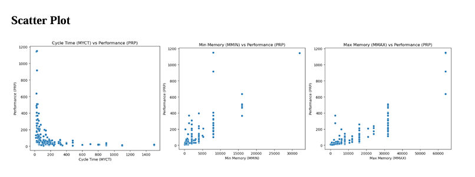
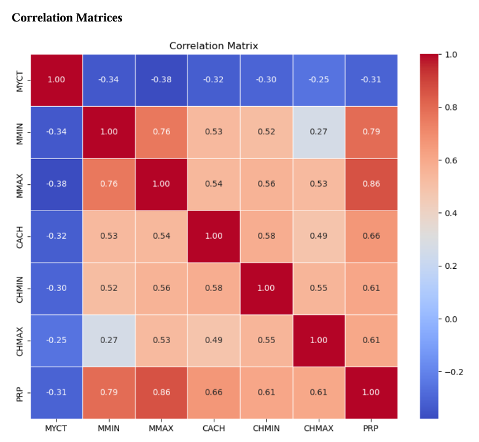
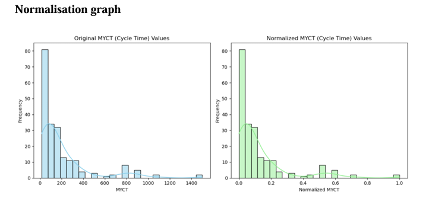
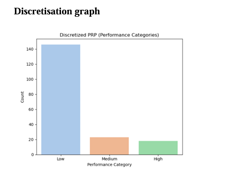
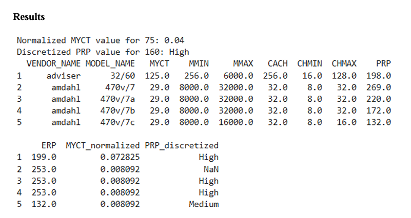

# Assignment 1: Exploratory Analysis and Data Pre-processing on Benchmark Datasets 💻

## 1. Assignment Summary
This assignment investigated the fundamental early pipeline configurations of a data mining lifecycle—exploring how raw data structures must be profiled, cleaned, and transformed before applying machine learning models. Working alongside my group member Lau Yan Kai, we conducted an empirical case study comparing two highly distinct benchmark datasets from the UCI Machine Learning Repository: the purely categorical **Mushroom Dataset** and the continuous, numerical **CPU Performance Dataset**. 

The main objective was to systematically evaluate attribute distributions, establish data relationships, and perform data pre-processing corrections using advanced transformation strategies. For the CPU dataset, we engineered data scaling corrections using min-max normalization alongside variable grouping via equal-width and equal-frequency binning discretisation methods. This demonstrated how data transformations eliminate feature scaling bias and convert erratic numeric columns into highly interpretable, clean categorizations ready for predictive model training.

---

## 2. Evidence and Explanation

### Part A: Exploratory Data Profiling & Association Maps

*Figure 1: Attribute Distribution and Dimensionality Relationships via Visual Mapping*

*Figure 2: Linear Relationship Coefficients and Collinearity Identification*

* **Attribute Profiling:** Dissected the 8,124 records of the Mushroom dataset across 22 categorical elements (such as cap shape and gill size) to group classification targets.
* **Collinearity Mapping:** Plotted multidimensional regression attributes as shown in **Figure 1** and generated numeric tables in **Figure 2** to flag overlapping variables (such as cache size against vendor performance indicators).

### Part B: Advanced Pre-processing Transformation Steps

*Figure 3: Min-Max Scaling Scaling Bounds to a Uniform [0, 1] Range*

*Figure 4: Continuous Data Transformation via Equal-Width and Equal-Frequency Binning*

*Figure 5: Transformed Categorical Outputs Following Attribute Binning Staging*

* **Min-Max Feature Scaling:** Transformed the CPU machine features into a unified boundary system ($[0, 1]$ range) as illustrated in **Figure 3**, preventing columns with massive values from overwhelming model weight calculations.
* **Binning Discretisation Loops:** Processed continuous columns through equal-width and equal-frequency distribution buckets shown in **Figure 4** and **Figure 5**, effectively converting unorganized, raw numeric values into clean categorical data blocks.

---

## 3. Reflection

### What I Learned
* Comparing categorical and numerical profiles showed me that different data formats require completely different pre-processing strategies. While the Mushroom dataset was ready for classification out of the box, the CPU dataset required intense numerical adjustment to make it usable.
* Implementing min-max feature scaling taught me how unbalanced features can warp model logic. Standardizing features into a clean $[0, 1]$ window ensures that distance-based metrics evaluate every column fairly during model training.
* Testing equal-width and equal-frequency binning strategies helped me understand data distribution balance. I learned that choosing the right discretization split is critical for turning complex numeric values into clean, predictable categories.

### Areas for Improvement
* Designing discretisation bins manually using fixed width rules can cut off natural groupings if the underlying distribution is highly skewed. I want to research automated k-means clustering methods to group continuous values based on true statistical densities.
* Managing multiple visual plots using separate tracking tools can get messy as datasets grow. I intend to build automated data profiling code arrays using Python's `Seaborn` and `Plotly` libraries to generate dynamic dashboard summaries.
