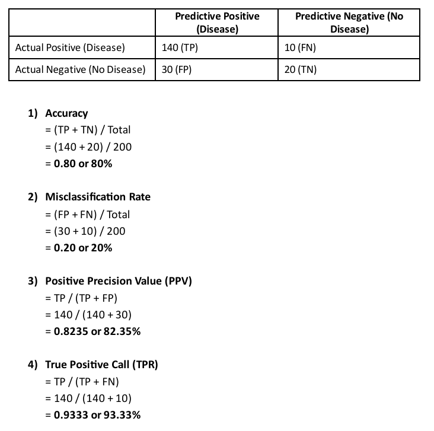

# Tutorial 1: Binary Classification Performance Evaluation and Validation Methods 🎯

## 1. Tutorial Summary
This foundational tutorial focused on the analytical evaluation of predictive machine learning models using mathematical verification matrices. It is designed to bridge the gap between theoretical algorithm construction and empirical performance tracking. Working with distinct binary classification problem sets, including medical diagnostic tests, electronic spam email filters, and customer churn retention logs. I structured raw classification results into empirical confusion matrices. The analysis required dissecting how data elements distribute across **True Positive(TP)**, **True Negative(TN)**, **False Positive(FP)**, and **False Negative** quadrants when encountering varying levels of noise and class frequencies.

Through systematic formula applications, I calculated and interpreted critical performance boundaries, including overall **Accuracy, Misclassification Rate (Error Rate), Positive Predictive Value (Precision), and True Positive Rate (Sensitivity/Recall)**. Beyond basic static scoring, the tutorial explored the theoretical concepts of model performance degradation. This included contrasting overfitting and underfitting states, diagnosing structural mapping flaws within multi-variable environments, and evaluating robust data validation setups—such as hold-out partitioning and K-fold cross-validation loops—to ensure predictive systems generalize reliably to unseen target profiles.

---

## 2. Evidence and Explanation

*Figure 1: Empirical Formula Derivations and Performance Metric Diagnostics*

* **Confusion Matrix Construction:** Categorized test outputs across 200 to 300 sample rows into exact quadrants tracking True Positives ($TP$), True Negatives ($TN$), False Positives ($FP$), and False Negatives ($FN$).
* **Precision and Recall Derivation:** Calculated predictive sensitivity metrics across distinct target classes as demonstrated in **Figure 1**. For instance, in the patient diagnosis dataset, I established an Accuracy of **80%**, a high True Positive Rate (Sensitivity) of **93.33%**, and a Positive Predictive Value (Precision) of **82.35%**.
* **Model Fit Assessment:** Evaluated indicators for structural modeling flaws, distinguishing between overfitting (where a model captures excessive noise from training boundaries) and underfitting (where a model lacks the mathematical complexity to map core underlying patterns).
* **Validation Strategy Planning:** Documented structural data division methods to guide future model development, defining hold-out parameter splits (e.g., 80% training vs. 20% testing sets) and K-fold cross-validation rotations to ensure unbiased performance evaluation.

---

## 3. Reflection

### What I Learned
* Working through confusion matrix derivations changed how I view machine learning accuracy. I learned that a high baseline accuracy score can be deeply misleading if a model suffers from high false positive rates, highlighting why looking at precision and recall together is essential for critical workflows like medical diagnostics.
* Dissecting the core differences between overfitting and underfitting helped me understand how models generalize. I learned that finding the right balance between model complexity and training data volume is key to preventing a model from failing when deployed on unseen data.
* Studying hold-out and K-fold cross-validation strategies provided me with a structured approach to model training. It showed me how systematic data rotation protects against validation bias and ensures that measured performance metrics match real-world reliability.
